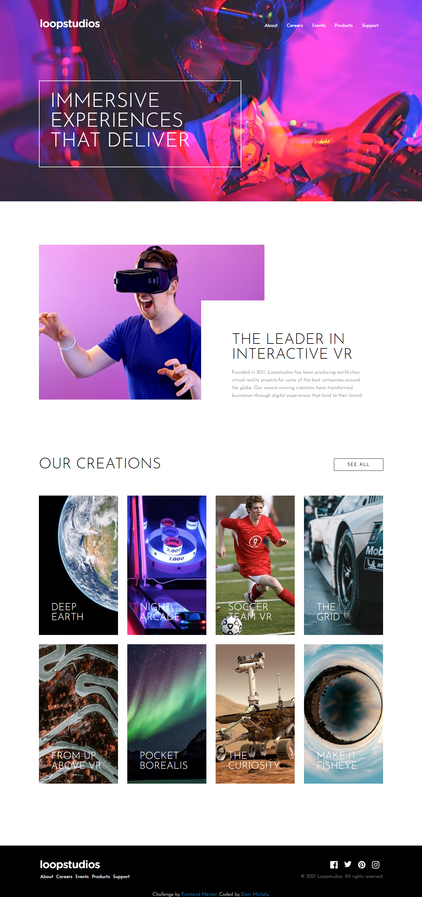

# Frontend Mentor - Loopstudios landing page solution

Esta é uma solução para o [Loopstudios landing page challenge do Frontend Mentor](https://www.frontendmentor.io/challenges/loopstudios-landing-page-N88J5Onjw). Eu construí esta página com o objetivo de melhorar minhas habilidades de codificação ao construir projetos reais.


## Visão Geral

### O Desafio

Os usuários devem ser capazes de:

- Visualizar o layout ideal para o site, de acordo com tamanho da tela do dispositivo.
- Ver os estados de foco para todos os elementos interativos na página.

### Screenshot




### Links

- URL da solução: https://dani-michely-loopstudios.netlify.app/

  

## Meu processo

### Construído com

- HTML5

- CSS

- Flexbox

- CSS Grid

- Media Queries

- JavaScript

  

### O que eu aprendi

Usei o desafio para desenvolver e aprimorar meus conhecimentos em construções de Landing Pages. Gostei de treinar o pseudocódigo after dentro do hover.

```css
.menu ul li a:hover::after {
     content: '';
     color: currentColor;
     width: 30px;
     height: 2px;
     background: currentColor;
     display: block;
     margin: 10px auto;     
}
```


## Autora

- Linkedin - [Dani Michely](https://www.linkedin.com/in/dani-michely/)

  

